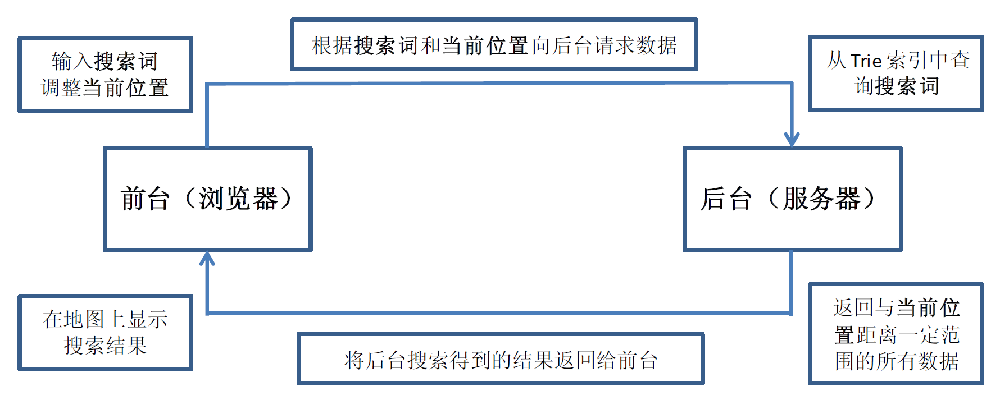
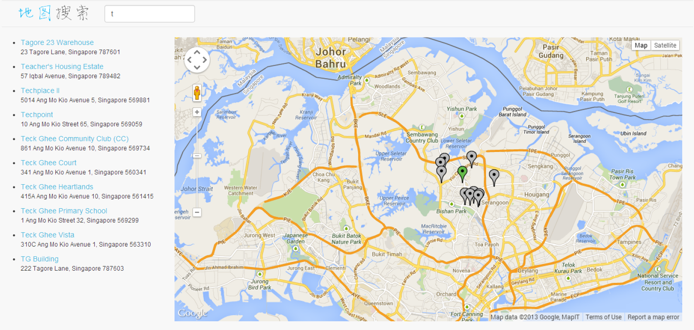

Type-ahead Search
=============

A simple type-ahead search with **Trie** data structure implementation using Java Dynamic Web.

## Design Pattern

## Search Page

## Requirements

- Java environment and Server environment
	- such as Java SE and Apache Tomcat
- Eclipse (optional, it may be better)
	- add Server project before running this project
- Update the variable `dataPath` with your new data path in **SearchServer.java**
